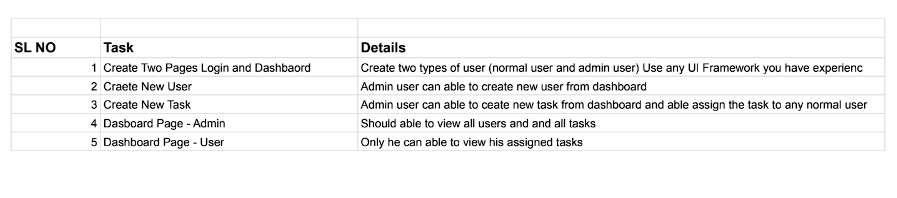
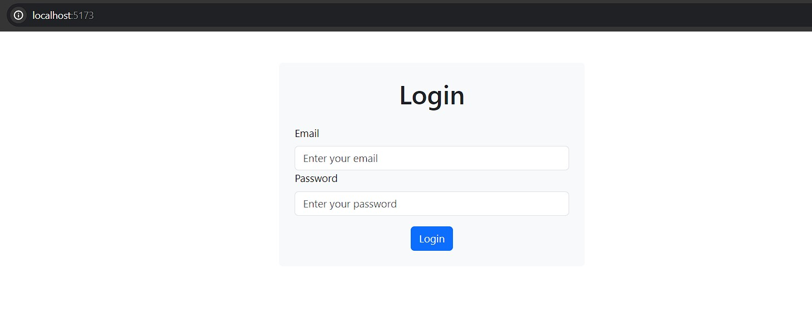
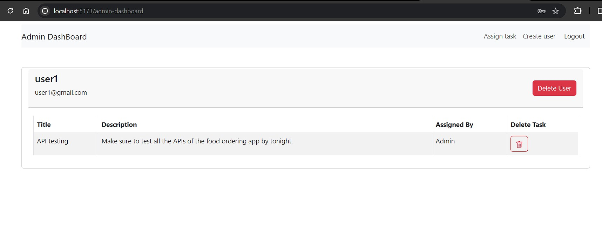
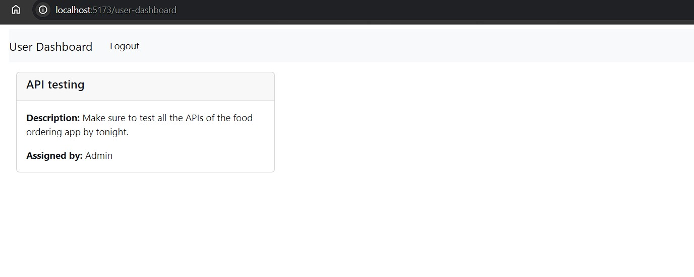
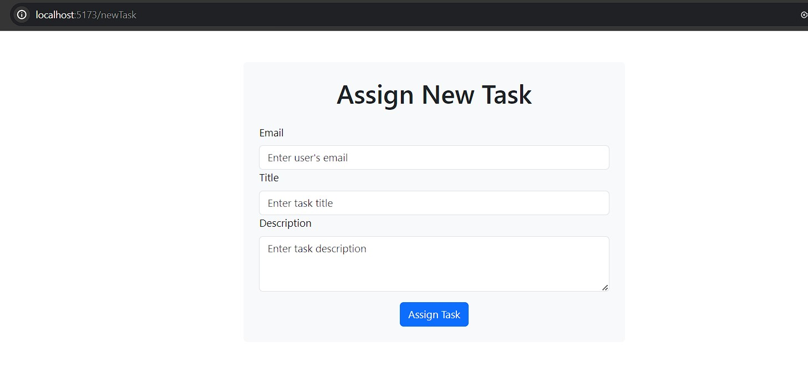
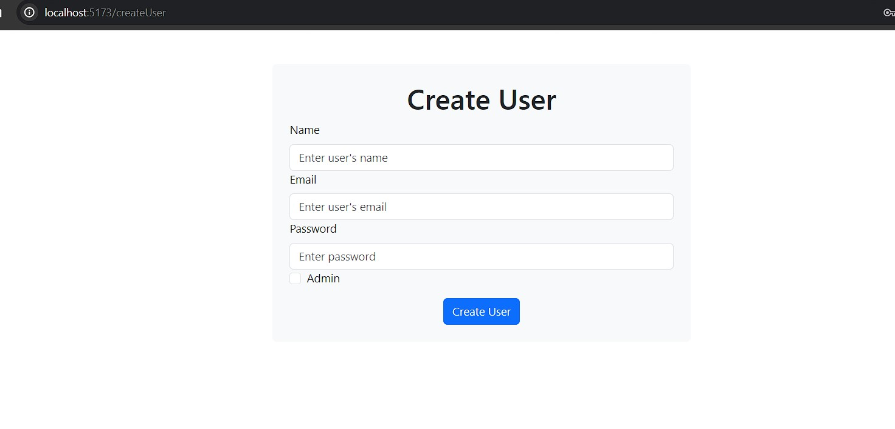

# Assignment



## Features

- User Login
- User Dashboard
  - User can all the tasks assign to them
- Admin Dashboard
  - View all users with their tasks
  - Create new users
  - Create new tasks and assign them to users
  - Delete users
  - Delete tasks

## Technologies Used

- React
- React-Router
- React-Bootstrap
- Node.js
- Express
- MongoDB

## Getting Started

### Installation

1. Clone the repository:

   ```bash
   git clone https://github.com/Kartik213/MeghplatAssignment.git
   cd MeghplatAssignment
   ```
2. Install Dependencies

    ```
    cd client
    npm install
    ```
    ```
    cd server
    npm install
    ```

3. Create a .env file in server with following content in it
    ```
    PORT=3000
    
    MONGO_URL=
    
    JWT_SECRET=
    ```

4. Start the development server

    ```
    cd server
    node app.js
    ```

    ```
    cd client
    npm run dev
    ```

### Usage

- Make admin account using http://localhost:5173/registerAdmin for the first time

- Visit http://localhost:5173/ and login with the admin user and start using the website.

- After logging in with the admin user you can create new users and assign tasks to them.

- You can also login as a normal user after creating the user from the admin-dashboard to see the user-dashboard where only the tasks assigned to that particular user are displayed.

###Images for Reference

#### Login page

#### Admin dashboard

#### User dashboard

#### Assign new task

#### Create new user

